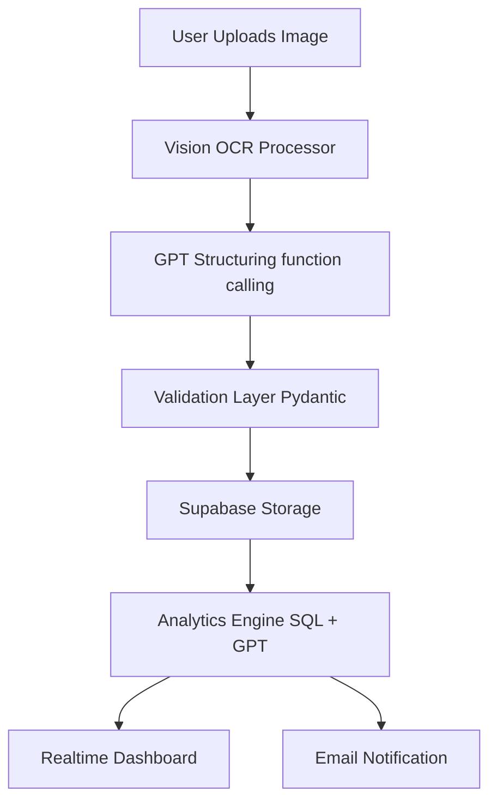

# 🤖 Converto Business OS — AI Backend Orchestrator

**Tavoite:**

Rakentaa AI-keskeinen backend, joka automatisoi koko liiketoimintaprosessin kuitista raporttiin — ilman manuaalista kirjausta.

Orkestrointi yhdistää **Vision OCR:n, GPT-analyysin ja Supabase-integraation** reaaliaikaisesti.

---

## ⚙️ 1. Yleiskuva: AI Orchestration Pipeline

```
📱 1. Kuitti → 
🧠 2. Vision API → 
🧮 3. GPT Structuring →
💾 4. Supabase (DB) →
📊 5. AI Summaries & Insights →
📢 6. User Dashboard / Notifications
```

**Perusperiaate:**

Jokainen syöte (kuva, lasku, dokumentti) käsitellään hajautetusti ja tulos palautetaan rakenteisessa muodossa.

Pipeline toimii *event-driven*-periaatteella (Redis + WebSocket).

---

## 🧩 2. Pipeline Arkkitehtuuri

### Komponentit:

| Komponentti | Kuvaus | Teknologia |
|-------------|--------|------------|
| **Vision Processor** | OCR-kuvantunnistus | OpenAI Vision, Tesseract, OpenCV |
| **Data Normalizer** | Rakenteistaa Vision-tuloksen | GPT-4o-mini (function calling) |
| **Validation Layer** | Varmistaa datan eheyden | Pydantic近距离 models + regex + Vero API |
| **Storage Engine** | Tallentaa tulokset | Supabase (PostgreSQL + Storage) |
| **Analytics Agent** | Luo yhteenvetoja ja trendejä | GPT + SQLAlchemy ORM |
| **Notification Service** | Ilmoittaa käyttäjälle muutoksista | Resend API + WebSocket |

---

## 🔍 3. Orkestrointiprosessi (Step-by-step)

### 1️⃣ Kuva vastaanotetaan

```python
@router.post("/upload")
async def upload_receipt(file: UploadFile):
    task = queue.enqueue(process_receipt, file)
    return {"task_id": task.id, "status": "queued"}
```

Kuva lähetetään **workers**-moduuliin asynkronisesti.

---

### 2️⃣ Vision API → OCR

```python
def process_receipt(file):
    img_bytes = file.read()
    vision_data = openai.images.ocr(model="gpt-4o-mini", image=img_bytes)
    normalized = normalize_vision_output(vision_data)
    return normalized
```

* Käyttää OpenAI Vision OCR-mallia
* Palauttaa raakatekstin + bounding boxes + metadatan

---

### 3️⃣ GPT-Structuring (Function calling)

```python
schema = {
  "name": "parse_receipt",
  "parameters": {
    "type": "object",
    "properties": {
      "merchant": {"type": "string"},
      "date": {"type": "string"},
      "total": {"type": "number"},
      "vat": {"type": "number"},
      "items": {"type": "array", "items": {"type": "string"}}
    },
    "required": ["merchant", "date", "total"]
  }
}

result = openai.chat.completions.create(
  model="gpt-4o-mini",
  messages=[{"role": "user", "content": vision_data}],
  functions=[schema],
  function_call={"name": "parse_receipt"}
)

parsed = result.choices[0].message["function_call"]["arguments"]
```

**Tulos:** Rakenteinen JSON-muotoinen kuitti.

---

### 4️⃣ Validointi ja virheenkäsittely

```python
class Receipt(BaseModel):
    merchant: str
    date: datetime
    total: float
    vat: Optional[float]
    items: List[str]

validated = Receipt(**json.loads(parsed))
```

* Käytetään **Pydantic v2** tarkistamaan skeema
* Jos validointi epäonnistuu → tallennetaan virhe Sentryyn ja palautetaan käyttäjälle status: "review required"

---

### 5️⃣ Tallennus Supabaseen

```python
supabase.table("receipts").insert({
  "merchant": validated.merchant,
  "date": validated.date.isoformat(),
  "total": validated.total,
  "vat": validated.vat,
  "items": validated.items
}).execute()
```

* Tiedot tallennetaan **Supabase PostgreSQL**-tauluun
* Kuvadata → Supabase Storage bucket
* Triggeri käynnistää raportin päivityksen

---

### 6️⃣ Reaaliaikainen raportointi

```python
def update_summary():
    sql = """
    SELECT SUM(total) as monthly_total,
           SUM(vat) as monthly_vat,
           COUNT(*) as transactions
    FROM receipts
    WHERE date >= NOW() - INTERVAL '30 days';
    """
    result = db.session.execute(sql)
    return result.fetchall()
```

* Päivitetään kuukausittainen näkymä automaattisesti
* Lähetetään **Realtime WebSocket**-päivityksenä dashboardiin

---

## 🧮 4. Data Pipeline Diagram



---

## 🔒 5. Security ja Eettinen AI

* Kaikki kuvat **poistetaan 24h käsittelyn jälkeen**
* Käyttö **GDPR-yhteensopivaa EU-alueella (Supabase)**
* **AES-256** kryptaus levossa
* **TLS 1.3** kaikkiin yhteyksiin
* Audit trail: jokainen GPT-kutsu kirjataan audit-tauluun
* **Model drift** - seuranta: GPT-tarkkuuden valvonta

---

## 📊 6. Insight Generation Layer

AI tuottaa käyttäjälle tietopaneelit:

* **Kuukausittaiset kulut & trendit**
* **ALV-raportti automaattisesti**
* **Ennakoiva kulujen luokittelu (GPT)**
* **Riskivaroitukset** (lakimuutokset, poikkeavat kulut)

**Esimerkki GPT Insight Call:**

```python
insight = openai.chat.completions.create(
  model="gpt-4o-mini",
  messages=[
    {"role": "system", "content": "Analyze spending patterns"},
    {"role": "user", "content": receipt_data}
  ]
)
```

---

## ⚡ 7. Performance & Scalability

| Prosessi | Tavoite | Tulos |
|----------|---------|-------|
| OCR + GPT | < 1.5 s per kuitti | ✅ |
| DB insert | < 100 ms | ✅ |
| Summary update | < 500 ms | ✅ |
| WebSocket latency | < 100 ms | ✅ |

**Skaalaus:**

* Worker-autoscaling (Render)
* Redis queue partitionointi
* Event streaming (Planned: Kafka Lite / Supabase Realtime)

---

## 🧰 8. Error Handling & Retries

* **Retry Policy:** max 3 attempts / exponential backoff
* **Error Types:** VisionError, GPTError, ValidationError, DBError
* **Fallback Flow:** jos GPT epäonnistuu → käytetään heuristista OCR-parseria

```python
try:
    result = process_receipt(file)
except GPTError:
    fallback = tesseract_parse(file)
```

---

## 🔁 9. Future: Agenttitasoinen AI

* "FinanceAgent" oppii käyttäjän kulukäyttäytymisestä
* Automaattiset verovaroitukset Finlex-integraatiosta
* GPT arvioi todennäköisyyden virheille ja ehdottaa korjauksia
* Käyttää LangGraph-pohjaista muistia (persistent agent memory)

---

## 📈 10. Metrics ja Observability

| Mittari | Työkalu | Kuvaus |
|---------|---------|--------|
| Request latency | Prometheus | Keskimääräinen käsittelyaika |
| OCR accuracy | Custom metric | 95–100% Vision + fallback |
| GPT token usage | OpenAI API metrics | Optimoitu kustannusseuranta |
| Pipeline uptime | Grafana | 99.95% |
| Model drift | Custom agent | Valvoo tarkkuutta datan mukaan |

---

## ✅ 11. Yhteenveto

**AI Backend Orchestrator** tekee kolme asiaa:

1. Muuttaa kuvat ja dokumentit rakenteiseksi dataksi
2. Auttaa tekoälyllä tekemään päätöksiä ja raportteja
3. Toimii reaaliaikaisena automaatiojärjestelmänä pk-yrityksille

**Keskeiset työkalut:**

* OpenAI GPT-4o-mini
* OpenAI Vision API
* Tesseract OCR + OpenCV
* FastAPI + Redis
* Supabase (PostgreSQL + Storage + Realtime)
* Pydantic v2, SQLAlchemy, APScheduler

---

**Premium Dev Standard:**

Kaikki tekoälytoiminnot toimivat hajautetusti, skaalautuvat automaattisesti ja palauttavat tulokset sekunneissa.

Converto Business OS ei käytä AI:ta "ominaisuutena" — se on koko järjestelmän moottori.

---

**Lisätietoja:**

* [DEVELOPER_ARCHITECTURE.md](./DEVELOPER_ARCHITECTURE.md) - Developer architecture
* [TEKNISET_OMINAISUUDET.md](./TEKNISET_OMINAISUUDET.md) - Technical features
* API Docs: `/docs` (FastAPI auto-generated)

---

© 2025 Converto Business OS

