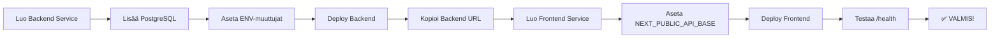

# 🔑 CONVERTO™ MVP - VÄLTTÄMÄTTÖMÄT ENV-MUUTTUJAT

**Päivitetty**: October 14, 2025
**Target**: Render.com Production Deployment
**Status**: MVP-Ready

---

## ⚡ **PIKAOHJEET (TL;DR)**

### **BACKEND (Render Web Service):**
```bash
ENV=production
AI_PROVIDER=openai
OPENAI_API_KEY=sk-proj-xxx
JWT_SECRET=<generate-with-openssl>
```

### **FRONTEND (Render Static/Web Service):**
```bash
NEXT_PUBLIC_API_BASE=https://converto-backend.onrender.com
NEXT_PUBLIC_APP_ENV=production
FEATURE_PREMIUM_HOME=1
```

### **DATABASE:**
- Render luo automaattisesti `DATABASE_URL`
- Älä aseta manuaalisesti!

---

## 📋 **TÄYDELLINEN LISTA**

### ✅ **PAKOLLISET (MVP EI TOIMI ILMAN)**

#### **Backend:**
| Muuttuja | Arvo | Mistä? | Miksi? |
|----------|------|--------|--------|
| `ENV` | `production` | Käsin | Määrittää ympäristön |
| `AI_PROVIDER` | `openai` | Käsin | AI-moottori |
| `OPENAI_API_KEY` | `sk-proj-...` | platform.openai.com | AI-toiminnot |
| `JWT_SECRET` | 32+ merkkiä | `openssl rand -hex 32` | Auth-token |

#### **Frontend:**
| Muuttuja | Arvo | Mistä? | Miksi? |
|----------|------|--------|--------|
| `NEXT_PUBLIC_API_BASE` | `https://...onrender.com` | Backend URL | API-yhteys |
| `NEXT_PUBLIC_APP_ENV` | `production` | Käsin | Ympäristö |
| `FEATURE_PREMIUM_HOME` | `1` | Käsin | Premium UI |

---

### 🟢 **SUOSITELLUT (PARANTAVAT KOKEMUSTA)**

| Muuttuja | Arvo | Miksi? |
|----------|------|--------|
| `RESEND_API_KEY` | `re_...` | Magic Link -kirjautuminen |
| `SENTRY_DSN` | `https://...` | Virheseuranta |

---

### 🔵 **VALINNAISET (PREMIUM-OMINAISUUDET)**

#### **AI & Vision:**
| Muuttuja | Kuvaus |
|----------|--------|
| `OLLAMA_HOST` | Paikallinen AI (http://localhost:11434) |
| `OLLAMA_MODEL` | Malli (mistral, llama3) |
| `VISION_PROVIDER` | OCR-provider (openai/tesseract) |
| `OPENAI_VISION_MODEL` | gpt-4o-mini |

#### **Payments:**
| Muuttuja | Kuvaus |
|----------|--------|
| `STRIPE_SECRET_KEY` | Maksut |
| `STRIPE_PUBLISHABLE_KEY` | Frontend-avain |

#### **Storage:**
| Muuttuja | Kuvaus |
|----------|--------|
| `S3_REGION` | Cloudflare R2 / AWS S3 |
| `S3_BUCKET` | Bucket-nimi |
| `S3_ACCESS_KEY_ID` | Access key |
| `S3_SECRET_ACCESS_KEY` | Secret key |
| `S3_ENDPOINT` | R2/S3 endpoint |

#### **Integrations:**
| Muuttuja | Kuvaus |
|----------|--------|
| `WHATSAPP_META_TOKEN` | WhatsApp API |
| `WHATSAPP_PHONE_ID` | Phone number ID |
| `NOTION_API_KEY` | Notion sync |
| `NOTION_DATABASE_ID` | Database ID |
| `POSTHOG_API_KEY` | Analytiikka |
| `POSTHOG_HOST` | EU host |

---

## 🔧 **RENDER.COM SETUP**

### **1. Backend Web Service**

**Environment Variables:**
```
ENV = production
AI_PROVIDER = openai
OPENAI_API_KEY = sk-proj-xxx
JWT_SECRET = <32-char-random-string>
```

**Database:**
- Lisää "PostgreSQL" Render dashboardista
- Render asettaa `DATABASE_URL` automaattisesti
- ✅ Ei tarvitse lisätä manuaalisesti!

**Build Command:**
```bash
pip install -U pip && pip install -r requirements.txt
```

**Start Command:**
```bash
uvicorn app.main:app --host 0.0.0.0 --port $PORT
```

---

### **2. Frontend Static Site / Web Service**

**Environment Variables:**
```
NEXT_PUBLIC_API_BASE = https://converto-backend.onrender.com
NEXT_PUBLIC_APP_ENV = production
FEATURE_PREMIUM_HOME = 1
```

**Build Command:**
```bash
cd frontend && npm ci && npm run build
```

**Start Command (jos Web Service):**
```bash
cd frontend && npm run start
```

**Publish Directory (jos Static Site):**
```
frontend/out
```

---

## 🔐 **TURVALLISUUS**

### **Avaimen generoiminen:**
```bash
# JWT_SECRET
openssl rand -hex 32

# Output esim:
# a1b2c3d4e5f6a1b2c3d4e5f6a1b2c3d4e5f6a1b2c3d4e5f6a1b2c3d4
```

### **Huomioitavaa:**
- ✅ ÄLÄ koskaan commitoi `.env` Gitiin
- ✅ Käytä Renderin "Secret File" -ominaisuutta .env-tiedostoille
- ✅ Vaihda JWT_SECRET tuotantoon siirryttäessä
- ✅ Käytä eri avaimia staging/production-ympäristöissä

---

## 📝 **KOPIOI-LIITÄ YMPÄRISTÖT**

### **Staging (render.staging.yaml):**
```yaml
envVars:
  - key: ENV
    value: staging
  - key: AI_PROVIDER
    value: openai
  - key: OPENAI_API_KEY
    sync: false  # Aseta Render UI:ssa
  - key: JWT_SECRET
    sync: false
  - key: NEXT_PUBLIC_API_BASE
    value: https://converto-backend-staging.onrender.com
  - key: NEXT_PUBLIC_APP_ENV
    value: staging
  - key: FEATURE_PREMIUM_HOME
    value: "1"
```

### **Production (render.prod.yaml):**
```yaml
envVars:
  - key: ENV
    value: production
  - key: AI_PROVIDER
    value: openai
  - key: OPENAI_API_KEY
    sync: false
  - key: JWT_SECRET
    sync: false
  - key: NEXT_PUBLIC_API_BASE
    value: https://api.converto.fi
  - key: NEXT_PUBLIC_APP_ENV
    value: production
  - key: FEATURE_PREMIUM_HOME
    value: "1"
```

---

## ✅ **CHECKLIST ENNEN DEPLOYTA**

### **Backend:**
- [ ] `OPENAI_API_KEY` asetettu (testaa: `curl https://api.openai.com/v1/models -H "Authorization: Bearer $KEY"`)
- [ ] `JWT_SECRET` generoitu (min 32 merkkiä)
- [ ] PostgreSQL database lisätty Renderiin
- [ ] `DATABASE_URL` näkyy Render-dashboardissa (automaattinen)

### **Frontend:**
- [ ] `NEXT_PUBLIC_API_BASE` osoittaa backend-URLiin
- [ ] `FEATURE_PREMIUM_HOME=1` asetettu
- [ ] Build toimii lokaalisti: `cd frontend && npm run build`

### **Molemmat:**
- [ ] Health-endpointit toimivat:
  - Backend: `/health`
  - Frontend: `/api/health` (jos Web Service)
- [ ] CORS sallii frontendin domain
- [ ] Custom domains konfiguroitu (jos käytössä)

---

## 🚀 **MVP-DEPLOYMENT FLOW**


```mermaid
graph LR
    A[Luo Backend Service] --> B[Lisää PostgreSQL]
    B --> C[Aseta ENV-muuttujat]
    C --> D[Deploy Backend]
    D --> E[Kopioi Backend URL]
    E --> F[Luo Frontend Service]
    F --> G[Aseta NEXT_PUBLIC_API_BASE]
    G --> H[Deploy Frontend]
    H --> I[Testaa /health]
    I --> J[✅ VALMIS!]
```

---

## 💡 **TESTI-KOMENNOT**

### **Backend Health Check:**
```bash
curl https://converto-backend.onrender.com/health
# Expected: {"status":"healthy","version":"0.1.0",...}
```

### **Frontend Health Check:**
```bash
curl https://converto-frontend.onrender.com
# Expected: HTML with "Converto™"
```

### **Auth Test:**
```bash
curl -X POST https://converto-backend.onrender.com/api/v1/auth/magic/request \
  -H "Content-Type: application/json" \
  -d '{"email":"test@converto.fi"}'
# Expected: {"status":"sent",...}
```

---

## 📞 **TUKI**

**Ongelmat?**
1. Tarkista Render-lokit: Dashboard → Service → Logs
2. Varmista ENV-muuttujat: Dashboard → Environment
3. Testaa lokaalisti ensin: `uvicorn app.main:app --reload`

**Yleisimmät virheet:**
- ❌ `DATABASE_URL` puuttuu → Lisää PostgreSQL Renderiin
- ❌ `OPENAI_API_KEY` virheellinen → Tarkista platform.openai.com
- ❌ Frontend ei yhdistä → Tarkista `NEXT_PUBLIC_API_BASE`
- ❌ CORS-virhe → Lisää frontend domain backendiin

---

**CONVERTO™ BUSINESS OS - MVP READY! 🚀**
